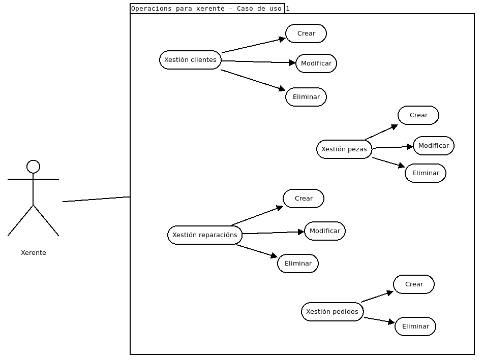

# FASE DE DESEÑO

## Modelo conceptual do dominio da aplicación e/ou Diagrama de clases [usando UML, ConML, ou linguaxe semellante].

## Casos de uso [descritos en fichas e/ou mediante esquemas; deben incluír o(s) tipo(s) de usuario implicados en cada caso de uso].

## Deseño de interface de usuarios [mockups ou diagramas...].

## Diagrama de Base de Datos.

## Diagrama de compoñentes software que constitúen o produto e de despregue.

