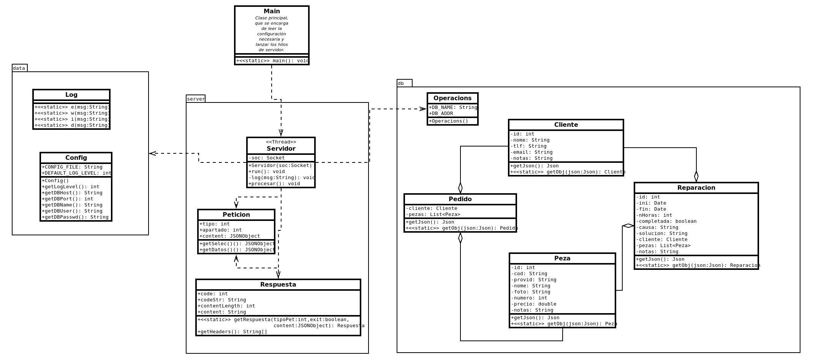
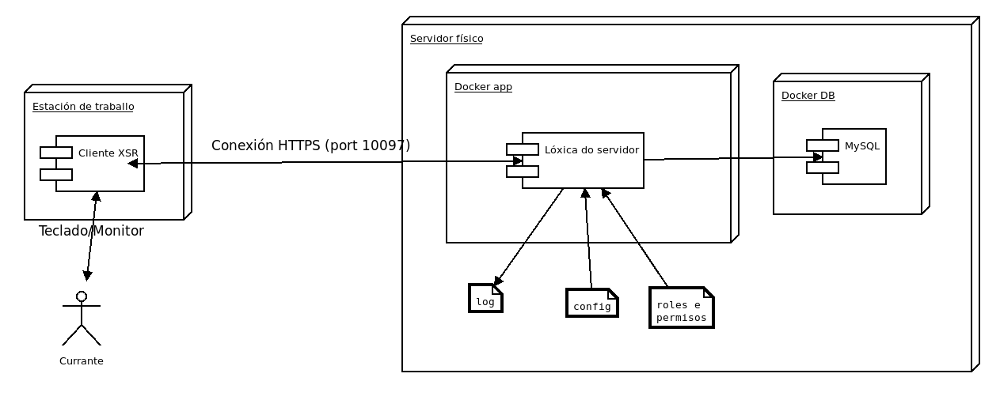

# FASE DE DESEÑO

## Modelo conceptual do dominio da aplicación e/ou Diagrama de clases [usando UML, ConML, ou linguaxe semellante].



## Casos de uso [descritos en fichas e/ou mediante esquemas; deben incluír o(s) tipo(s) de usuario implicados en cada caso de uso].


## Mensaxes

Este aparatado explica a estructura dos mensaxes intercambiados entres os clientes e o servidor.

> Un detalle importante é que as imaxes están sempre codificadas en **base64** para que poidan ser incluidas no JSON. Serán os clientes os encargados de codificar e descodificalas.

### Peticións

As peticións consisten en Peticións HTTP POST.

O corpo das peticións (o JSON) envíase encriptado cunha clave privada que identifica o cliente.
O servidor utiliza a clave pública para descifralo e identificar o cliente autorizado.

O corpo das peticións ten sempre esta estructura:

> Os `[]` indican datos opcionais


```
{
	"usuario": {
		"rol": <ROL>
	},
	"operacion": {
		"apartado": <APARTADO>,
		"tipo": <get|crete|update|delete>,
		["selec": {}],
		["datos": {}]
	}
}
```

Exemplo de petición para consultar crear, editar e eliminar un cliente
```
POST / HTTP/1.1
HOST: servidor:10097
Content-Type: applicaiton/json
Content-Length: <LENGTH>
Accept: application/json

{
	"usuario": {
		"rol": "xerente"
	},
	"operacion": {
		"apartado": "x_clientes",
		"tipo": "get",
		"selec": {}
	}
}
```

```
POST / HTTP/1.1
HOST: servidor:10097
Content-Type: applicaiton/json
Content-Length: <LENGTH>
Accept: application/json

{
	"usuario": {
		"rol": "xerente"
	},
	"operacion": {
		"apartado": "x_clientes",
		"tipo": "create",
		"datos": {
			"cliente": {
				"nome": "Pepito",
				"tlf": "666666666",
				"email": "pepito@pepitoweb.net",
				"notas": ""
			}
		}
	}
}
```

```
POST / HTTP/1.1
HOST: servidor:10097
Content-Type: applicaiton/json
Content-Length: <LENGTH>
Accept: application/json

{
	"usuario": {
		"rol": "xerente"
	},
	"operacion": {
		"apartado": "x_clientes",
		"tipo": "update",
		"selec": {
			"nome": "Pepito"
		},
		"datos": {
			"cliente": {
				"tlf": "666777777",
				"notas": "Nova dirección: Rosalia 7, 3º A"
			}
		}
	}
}
```

```
POST / HTTP/1.1
HOST: servidor:10097
Content-Type: applicaiton/json
Content-Length: <LENGTH>
Accept: application/json

{
	"usuario": {
		"rol": "xerente"
	},
	"operacion": {
		"apartado": "x_clientes",
		"tipo": "delete",
		"selec": {
			"nome": "Pepito"
		}
	}
}
```

Para operar con pezas ou reparacións sería igual pero cambiando *x_clientes* por *x_pezas* ou *x_repar* respectivamente.

Exemplo de peticións para crear ou eliminar pedidos
```
POST / HTTP/1.1
HOST: servidor:10097
Content-Type: applicaiton/json
Content-Length: <LENGTH>
Accept: application/json

{
	"usuario": {
		"rol": "currante"
	},
	"operacion": {
		"apartado": "x_pedido",
		"tipo": "create",
		"datos": {
			"cliente": {
				"id": 7
			},
			"peza": {
				"id": 18
			}
		}
	}
}
```

```
POST / HTTP/1.1
HOST: servidor:10097
Content-Type: applicaiton/json
Content-Length: <LENGTH>
Accept: application/json

{
	"usuario": {
		"rol": "currante"
	},
	"operacion": {
		"apartado": "x_pedido",
		"tipo": "delete",
		"datos": {
			"cliente": {
				"id": 7
			},
			"peza": {
				"id": 18
			}
		}
	}
}
```


### Respostas

O servidor responde co código HTTP adecuado para cada situación, ademais dos estándar:

 * 200: OK, usado cando o cliente solidita datos
 * 201: Cando se efectúa un cambio CUD
 * 400: Error de sintaxe na petición
 * 401: O corpo non está cifrado cunha clave coñecida
 * 403: O cliente ou usuario non ten permiso para esta operación


Exemplo de resposta de creacón correcta
```
HTTP/1.1 201 Created
Server: xsrd/1.0
Content-Type: application/json
Content-Length: 0
```


Exemplo de petición e resposta de consulta de datos
```
POST / HTTP/1.1
HOST: servidor:10097
Content-Type: applicaiton/json
Content-Length: <LENGTH>
Accept: application/json

{
	"usuario": {
		"rol": "currante"
	},
	"operacion": {
		"apartado": "x_pezas",
		"tipo": "get",
		"selec": {}
	}
}


HTTP/1.1 200 OK
Server: xsrd/1.0
Content-Type: application/json
Content-Length: <LENGTH>

{[
	{
		"id": 0,
		"codigo": "1586",
		"proveedor": "Impextrom",
		"nome": "Batería DJI Phantom 3",
		"img": "<IMAXE_CODIFICADA_EN_BASE64>",
		"precio": 47.85,
		"cantidade": 2,
		"notas": "https://www.impextrom.com/es/bateria-para-control-remoto-dji-phantom-3-advance-phantom-4-pro-phantom-4-p1000010012"
	},
	{
		"id": 1,
		"codigo": "ERT567",
		"proveedor": "Impextrom",
		"nome": "Lente de cámara negra para iPhone 7 Plus",
		"img": "<IMAXE_CODIFICADA_EN_BASE64>",
		"precio": 1.83,
		"cantidade": 7,
		"notas": "https://www.impextrom.com/es/lente-de-camara-negra-para-iphone-7-plus-p1000010344"
	},
	{
		"id": 2,
		"codigo": "789557654",
		"proveedor": "PCcomponentes",
		"nome": "MSI B365M PRO-VDH",
		"img": "<IMAXE_CODIFICADA_EN_BASE64>",
		"precio": 73.99,
		"cantidade": 1,
		"notas": "https://www.pccomponentes.com/msi-b365m-pro-vdh recomendable para usuario medio"
	},
]}
```

## Deseño de interface de usuarios [mockups ou diagramas...].

O servidor non conta con interface de usuario, esa función delégase nos clientes.

## Diagrama de Base de Datos.


## Diagrama de compoñentes software que constitúen o produto e de despregue.

