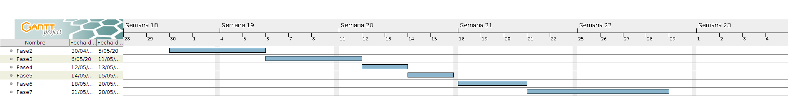

# FASE DE PLANIFICACIÓN DO PROXECTO

# Guía de planificación do proxecto

## Metodoloxía prevista

## Fases planificadas

Descríbense as fases en que se divide o proxecto.
Pódense indicar os recursos materiais e humanos asociados a cada tarefa ou, se son os mesmos, de maneira máis xeral.

> **Recursos**: Os recursos son exactamente os mesmos para todas as fases: 1 programador (eu), 1 PC (Ubuntu) e unha conexión a internet.

### Fase 1: Estudo de necesidades e modelo de negocio

#### Tarefa 1: xxxxxxxx

Descrición: 

Recursos hardware/software: 

Recursos humanos: Persoas que se encargarán de realizar esta tarefa

Duración: 

#### Tarefa 2
...

-------------------------------

### Fase 2: Proba de concepto

**Duración da fase**: 5 días

**Descrición**: Nesta fase realízase unha implementación sen funcionalidade real, pero que demostra que todas as tarefas son posibles (configuracion de contenedores, probas de conectividade, etc...).

**Obxetivo**: O servidor debería ser capaz de recibir peticións HTTP, ler o arquivo de configuración e conectarse coa base de datos.

#### Tarefa 1: Docker e build scripts

**Descrición**: Escribir os scripts *(Docker, Bash, SQL...)* que crean e configuran as imaxes.

#### Tarefa 2: Clases principais

**Descricion**: Escribir a funcadión das principais clases que forman o código. 
Algunhas destas clases son:
 * Main
 * Servidor
 * db.Operacions
 * data.Config
 * data.Log

-------------------------------------

### Fase 3: Xestión de Clientes

**Duración**: 4 días

**Descrición**: Nesta fase impleméntase a xestión de *Clientes*.

**Obxetivo**: Poder crear, consultar e actualizar clientes. Interactuar co cliente mediante JSON.

#### Tarefa 1: Clases

**Descrición**: Crear a Clase *Cliente* e os métodos de *Operacións*

#### Tarefa 2: Respostas

**Descrición**: Métodos no servidor para interpretar as peticións entrantes, compoñer a resposta adecuada e enviala.

----------------

### Fase 4: Pezas

**Duración**: 2 días

**Descrición**: Implementar xestión de *Pezas* de forma parecida á fase 3.

**Obxetivo**: Poder crear, consultar e actualizar pezas. Interactuar co cliente mediante JSON.

---------------------------------------

## Diagrama de Gantt

# Orzamento

O precio por día por traballador corresponde a 90€.
Considérase un día de traballo como 8h. O precio por hora por persoa é de 11,25€, calculado a partir das taboas salariais do [Convenio de consultoría](https://www.boe.es/eli/es/res/2018/02/22/(3)/dof/spa/pdf).

O consumo do equipo calcúlase utilizando a potencia da fonte de alimentación (600W) e o precio da corrente eléctrica a 0,07419 €/kWh.

Con estes cálculos saen 4.8 kWh/día -> 0,356112 €/día

> O consumo total por día é de **90.36 €**.

## Orzamento por actividade

| ACTIVIDADE	| DURACIÓN	| CUSTO (€)	|
| :--:			| --		| --:		|
| Fase 2		| 5 días	| 451.75	|
| Fase 3		| 4 dáis	| 361.44	|
| Fase 4		| 2 días	| 180.72	|
|				|			|			|
|				| TOTAL		| 993.91	|

## WEBGRAFÍA
Guía para a elaboración de proyectos. Gobierno Vasco.
https://www.pluralismoyconvivencia.es/upload/19/71/guia_elaboracion_proyectos_c.pdf  (páxina 49 e seguintes)

